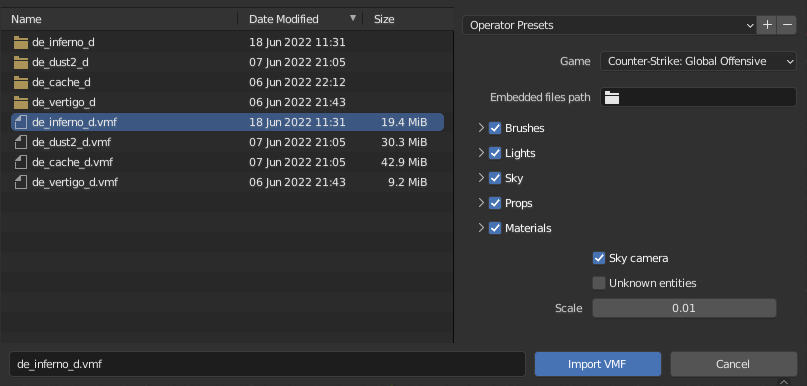
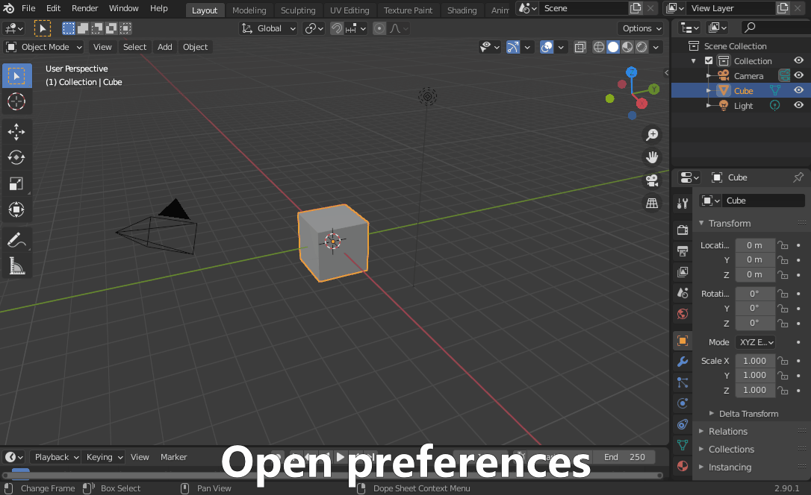

# io_import_vmf

A Valve Map Format (.vmf) and Valve Material Type (.vmt) importer addon for Blender.

This addon makes it possible to import full CS:GO, TF2, CS:S or other Source game maps into Blender.
The imported maps have accurate materials and overlays and correctly placed props and lights.
Skyboxes are converted into a Blender-compatible format
and 3D skyboxes can be easily transformed into the correct position and scale with minimal user intervention.
No manual game file extraction is required,
you just need to point the addon at your game directory and start importing.

Also includes helpful wrappers for importing [HLAE .agr files](https://www.advancedfx.org/) and .qc/.mdl models with materials using the included material importer.

The addon ships bundled with [Crowbar-Command-Line](https://github.com/UltraTechX/Crowbar-Command-Line) for automatic model decompilation.

## Table of contents
- [Requirements](https://github.com/lasa01/io_import_vmf#requirements)
- [Quick start](https://github.com/lasa01/io_import_vmf#quick-start)
- [Installation](https://github.com/lasa01/io_import_vmf#installation)
    - [Configuration](https://github.com/lasa01/io_import_vmf#configuration)
    - [Installing latest from source (advanced users)](https://github.com/lasa01/io_import_vmf#installing-latest-from-source-advanced-users)
- [Usage](https://github.com/lasa01/io_import_vmf#usage)
    - [Common import options](https://github.com/lasa01/io_import_vmf#common-import-options)
    - [Maps](https://github.com/lasa01/io_import_vmf#maps)
    - [Materials](https://github.com/lasa01/io_import_vmf#materials)
    - [QC / MDL](https://github.com/lasa01/io_import_vmf#qc--mdl-requires-blender-source-tools-or-sourceio)
    - [AGR](https://github.com/lasa01/io_import_vmf#agr-requires-afx-blender-scripts)
- [Credits](https://github.com/lasa01/io_import_vmf#credits)
- [License](https://github.com/lasa01/io_import_vmf#license)

## Requirements
- OS: Windows recommended. Everything except model/prop importing is also supported on Linux.
- Blender: 2.82 or newer.
- [Blender Source Tools](https://steamreview.org/BlenderSourceTools/) must be installed to import props or .qc models!

## Quick start
- Make sure you are using Blender 2.82 or newer.
- Install [Blender Source Tools](https://steamreview.org/BlenderSourceTools/).
- Install the latest release of this addon.
- Open the addon's preferences.
- (Optional) Specify a cache directory (used for caching processed game files).
- Add a game definition using the "+" button.
- Press "Detect from a game directory".
- Browse to the installation directory of a Source game of your choice.
- Select the game directory inside the game installation directory. (For example, the `csgo` directory for CS:GO.)
- Open the Blender console to get progress updates and start importing from the `File -> Import` menu.

## Installation
- Make sure you are using Blender 2.82 or newer.
- Download [Blender Source Tools](https://steamreview.org/BlenderSourceTools/).
- Download the latest addon release from the [releases](https://github.com/lasa01/io_import_vmf/releases) tab.
- Do **not** extract the downloaded files.
- Open Blender and install Blender Source Tools:

- Follow the same steps to install `io_import_vmf.zip`.

### Configuration
- Follow the instructions below to configure the addon for CS:GO:

- You can add multiple game definitions if you're using the addon for different games.
- Notes for other games:
    - The game directory is called `csgo` only for CS:GO.
    For other games it could be called `cstrike`, `hl2` and so on.
    - Some games may have multiple game directories (usually `hl2` in addition to the game-specific directory).
    In that case you need to click the detect button multiple times and select them all.
- (Advanced users) If the automatic detection fails to detect some required files, you can add them manually using the "+" buttons.

### Installing latest from source (advanced users)
- Make sure Python 3 is installed.
- Clone the repository (or download the repository as a .zip and extract).
- Open terminal/PowerShell and run `install.sh` or `install.ps1` depending on your OS.
- Make sure there are no errors in the terminal/PowerShell window.
- Follow the installation instructions above for the newly created .zip file.

## Usage

Blender may appear frozen when importing complex maps. To see the import progress and possible errors in realtime,
open the Blender console from `Window -> Toggle System Console`.
Unsupported material parameter warnings are normal, although they could mean that the importer can not recreate fully accurate materials.

### Common import options
- `Verbose`: Prints more information into the console, useful if you're running into issues.
- `Game definition`: Select the game you're importing assets from.

### Maps
`File -> Import -> Valve Map Format (.vmf)`

Source maps that ship with the game are in a compiled `.bsp` file format.
This addon can only import them in the original `.vmf` format.
You can use [BSPSource](https://github.com/ata4/bspsrc) to decompile the map files into the `.vmf` format supported by this addon.
BSPSource requires Java to be installed.
For CS:GO, the .bsp map files can be found inside
`Counter-Strike Global Offensive/csgo/maps/`.

Options:
- `Embedded files path`: You should leave this empty.
- `Solids`: Imports the "core" of the map: walls, floors etc.
    - `Brush epsilon`: You should not touch this.
    - `Invisible brushes`: By default, invisible brushes are not imported.
    If you want, you can import them by changing this.
    - `Import overlays`: Imports overlays that are on top of solids, such as bomb site sprays.
- `Props`: Imports all complex models in the map, such as cars and crates.
    - `Optimize props`: Optimizes props by removing empty armatures. You should leave this on.
    - `Reuse old models`: Reuses previously imported models in the current .blend file.
    - See [QC / MDL](https://github.com/lasa01/io_import_vmf#qc--mdl-requires-blender-source-tools-or-sourceio) for more options.
- `Materials`: Imports materials for solids, overlays and props.
    - See [Materials](https://github.com/lasa01/io_import_vmf#materials) for more options.
- `Lights`: Imports point lights and spotlights and the environment light (the sun).
    - `Brightness factors`: Controls how the brightnesses are converted into Blender. The default values are not fully accurate but good enough for most use cases.
- `Sky`: Imports the skybox as the world background.
    - `Sky resolution`: Controls the quality of the imported sky.
    The skybox is converted into a different format, so quality might suffer if this is set too low.
- `Import 3D sky origin`: Imports the origin point of the 3D sky used in 3D skybox transforming.
- `Scale`: Scales everything by this value. Usually you don't need to touch this.

Transforming the 3D sky
- After the import has finished, you need to manually select every object that belongs to the 3D sky.
- The 3D sky is usually clearly outside the main map area and in much smaller scale.
- Ensure you have the 3D sky origin (sky_camera) selected as the active object, and press `Object -> Transform VMF 3D sky` to transform the objects into the correct position and scale.

### Materials
`File -> Import -> Valve Material Type (.vmt)`

Options:
- `Simple materials`: You should enable this if you plan on exporting outside Blender.
- `Texture interpolation`: Selects the interpolation type for textures, the default value is a good choice.
- `Allow backface culling`: You can enable this if you know you need it.
- `Reuse old textures`: Reuses previously imported textures in the current .blend file.

### QC / MDL (requires [Blender Source Tools](https://steamreview.org/BlenderSourceTools/) or [SourceIO](https://github.com/REDxEYE/SourceIO))
`File -> Import -> Source Engine Model (enhanced) (.qc/.mdl)`

**Only supported on Windows!**

Options:
- `Skip collision meshes`: Skips collision meshes. You should leave this on.
- `Skip LOD meshes`: Skips importing different LOD levels for meshes. You should leave this on.
- `MDL strategy`: Selects which addon to use for .mdl importing. BST is recommended.
- `Materials`: Imports materials for the model.
    - See [Materials](https://github.com/lasa01/io_import_vmf#materials) for more options.

### AGR (requires [afx-blender-scripts](https://github.com/advancedfx/afx-blender-scripts))
`File -> Import -> HLAE afxGameRecord (enhanced) (.agr)`

**Only supported on Windows!**

Options:
- See [QC / MDL](https://github.com/lasa01/io_import_vmf#qc--mdl-requires-blender-source-tools-or-sourceio) for options.

## Credits
- Me for the addon, [VMF and VMT parser](https://github.com/lasa01/vmfpy) and [VTFLib wrapper](https://github.com/lasa01/pyvtflib).
- ValvePython for [VPK](https://github.com/ValvePython/vpk) and [Valve KeyValues](https://github.com/ValvePython/vdf) parser.
- Nemesis for [VTFLib](http://nemesis.thewavelength.net/index.php?p=40).
- Artfunkel for [Blender Source Tools](http://steamreview.org/BlenderSourceTools/).
- ZeqMacaw and UltraTechX for [Crowbar](https://steamcommunity.com/groups/CrowbarTool) and [Crowbar-Command-Line](https://github.com/UltraTechX/Crowbar-Command-Line).
- REDxEYE for [SourceIO](https://github.com/REDxEYE/SourceIO).
- Devostated for testing and bug reporting.
- Alex Flint and Pete Florence for [bilinear interpolation code](https://stackoverflow.com/a/12729229).
- adamb70 for [Python-Spherical-Projection](https://github.com/adamb70/Python-Spherical-Projection).

## License
This project is licensed under the MIT license. See LICENSE for more information.
